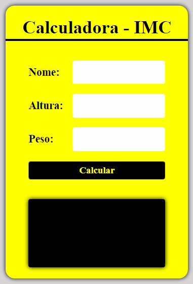

<h3 align="center">
  Calculadora IMC feita com HTML, CSS e Javascript.
</h3>

</img>

 Feito por: Patrick Feltrin 

<em> " A melhor época para plantar uma árvore foi há 20 anos. A segunda melhor é agora" </em>

  <a href="#features-adicionadas">Features</a>&nbsp;&nbsp;&nbsp;|&nbsp;&nbsp;&nbsp;
  <a href="#features-adicionadas">Como funciona</a>&nbsp;&nbsp;&nbsp;

## Features adicionadas

- [X] Cálculo do índice de massa corporal

- [X] Resposta com resultado do IMC e classificação da OMS

## Como funciona

